<div align="center">

<picture>
  <source media="(prefers-color-scheme: dark)" srcset="./assets/header-dark.svg">
  <source media="(prefers-color-scheme: light)" srcset="./assets/header-light.svg">
  
</picture>

<br>

[](https://www.linkedin.com/in/anouar-dadas/)
[](https://www.google.com/maps/place/Rabat)
[](https://github.com/CasualAnouar?tab=followers)
[](https://github.com/CasualAnouar)

**[whoami](#-whoami)** &nbsp;·&nbsp; **[stack](#-tech-stack)** &nbsp;·&nbsp; **[projects](#-projects)** &nbsp;·&nbsp; **[activity](#-activity)** &nbsp;·&nbsp; **[next](#-currently-exploring)**

</div>

---

## 🧭 whoami

Software developer building enterprise-grade web applications. Day to day that means Angular frontends, Spring Boot
microservices and Liferay DXP portals, wired together into platforms that real people depend on.

```ts
const anouar = {
  role:      "Senior Fullstack Engineer",
  location:  "Rabat, Morocco 🇲🇦",
  focus:     ["Angular 12→21+ frontends", "Spring Boot microservices", "Liferay DXP 7.4 portals"],
  learning:  ["Kubernetes", "GraphQL", "React Native"],
  speaks:    ["العربية", "Français", "English"],
  principle: "Ship it clean, ship it maintainable, ship it on time.",
} as const;
```

---

## 🧰 Tech Stack

| | |
| :-- | :-- |
| **Frontend** |           |
| **UI Kits** |     |
| **Backend** |       |
| **Auth & APIs** |     |
| **Enterprise** |    |
| **Data** |    |
| **DevOps** |       |
| **Daily drivers** |      |

---

## 🚀 Projects

| | Project | What it is | Built with | Where to see it |
| :--: | :-- | :-- | :-- | :-- |
| 🔍 | **lost-and-found** | Graduation project — a platform for reporting and reuniting lost items with their owners | `HTML` `Web` | 🔒 Private repo |
| 🎮 | **InFamouss** | Community hub for the InFamouss streamer — *Ghost Moves, Zero Noise* | `TypeScript` | [infamouss.net](https://www.infamouss.net) |
| 🌸 | **naroma-shop** | Perfume e-commerce storefront | `TypeScript` | [naroma-shop.vercel.app](https://naroma-shop.vercel.app) |
| 🤖 | **nyx-bot** | Discord bot + web dashboard for the Nyx community | `TypeScript` `Node.js` | [nyx-bot-web-fawn.vercel.app](https://nyx-bot-web-fawn.vercel.app) |

> Most of my work lives in private repositories, so the contribution graph below tells a fuller story than the repo list does.

---

## 📈 Activity

<div align="center">

<picture>
  <source media="(prefers-color-scheme: dark)" srcset="https://raw.githubusercontent.com/CasualAnouar/CasualAnouar/output/snake-dark.svg">
  <source media="(prefers-color-scheme: light)" srcset="https://raw.githubusercontent.com/CasualAnouar/CasualAnouar/output/snake-light.svg">
  
</picture>

<br><br>

<picture>
  <source media="(prefers-color-scheme: dark)" srcset="https://streak-stats.demolab.com?user=CasualAnouar&hide_border=true&background=0D1117&border=21262D&stroke=21262D&ring=58A6FF&fire=A371F7&currStreakNum=C9D1D9&sideNums=C9D1D9&currStreakLabel=58A6FF&sideLabels=8B949E&dates=6E7681">
  <source media="(prefers-color-scheme: light)" srcset="https://streak-stats.demolab.com?user=CasualAnouar&hide_border=true&background=FFFFFF&border=D1D9E0&stroke=D1D9E0&ring=0969DA&fire=8250DF&currStreakNum=1F2328&sideNums=1F2328&currStreakLabel=0969DA&sideLabels=59636E&dates=6E7781">
  
</picture>

<br><br>

<picture>
  <source media="(prefers-color-scheme: dark)" srcset="https://github-readme-activity-graph.vercel.app/graph?username=CasualAnouar&bg_color=0D1117&color=58A6FF&title_color=58A6FF&line=A371F7&point=7EE787&area=true&area_color=1F6FEB&hide_border=true&custom_title=Contributions%20in%20the%20last%2031%20days">
  <source media="(prefers-color-scheme: light)" srcset="https://github-readme-activity-graph.vercel.app/graph?username=CasualAnouar&bg_color=FFFFFF&color=0969DA&title_color=0969DA&line=8250DF&point=1A7F37&area=true&area_color=0969DA&hide_border=true&custom_title=Contributions%20in%20the%20last%2031%20days">
  
</picture>

</div>

---

## 🌱 Currently Exploring

| | | |
| :-- | :-- | :-- |
|  | Container orchestration | Making microservice deployments boring — in the good way |
|  | Flexible API layer | One endpoint instead of twenty, when it actually pays off |
|  | Cross-platform mobile | Taking the web skills to the phone |

---

## 💬 Let's talk

<div align="center">

🇲🇦 **Arabic** — Native &nbsp;&nbsp;·&nbsp;&nbsp; 🇫🇷 **French** — Professional &nbsp;&nbsp;·&nbsp;&nbsp; 🇬🇧 **English** — Professional

<br>

[](https://www.linkedin.com/in/anouar-dadas/)

<br>

> *"Measuring programming progress by lines of code is like measuring aircraft building progress by weight."*
> <br>— Bill Gates

<picture>
  <source media="(prefers-color-scheme: dark)" srcset="./assets/footer-dark.svg">
  <source media="(prefers-color-scheme: light)" srcset="./assets/footer-light.svg">
  
</picture>

</div>
